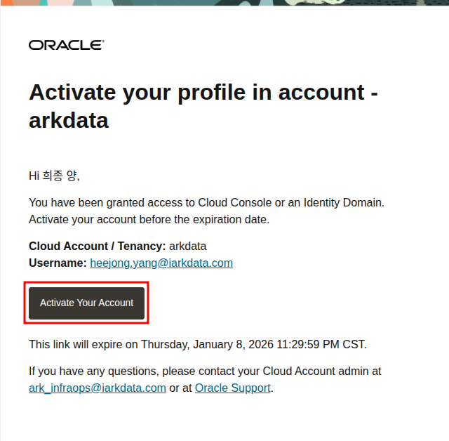
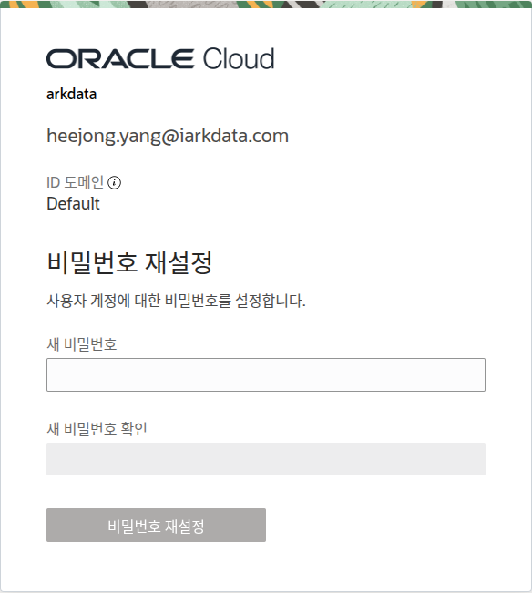
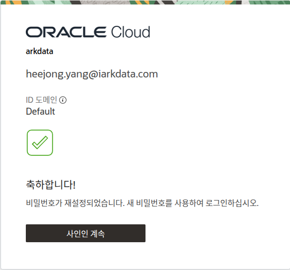
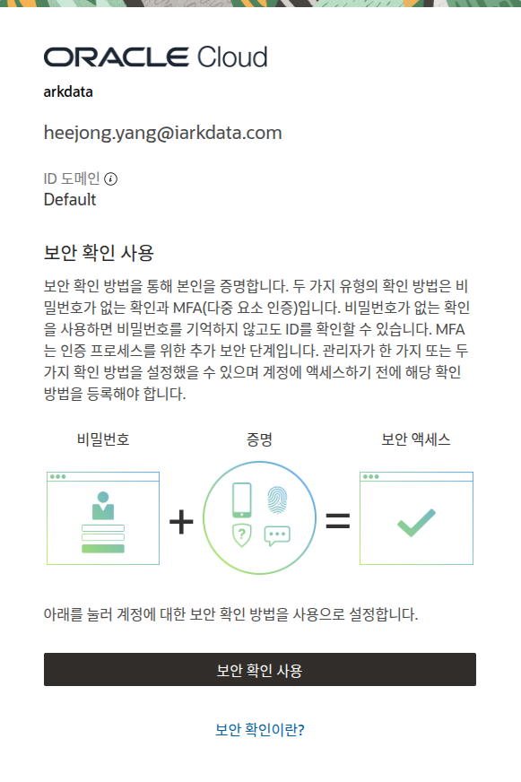
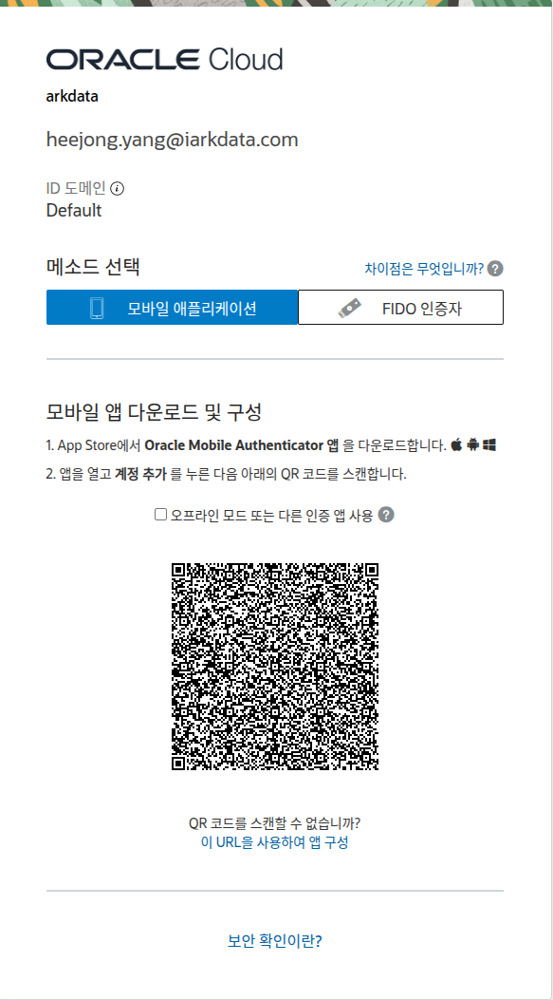
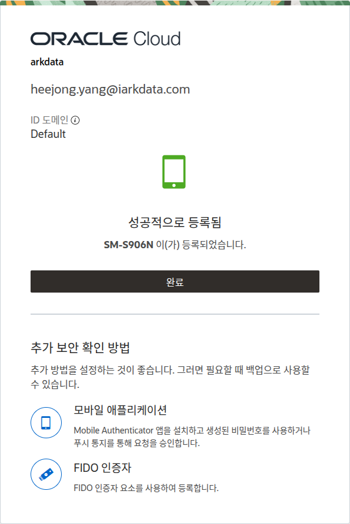
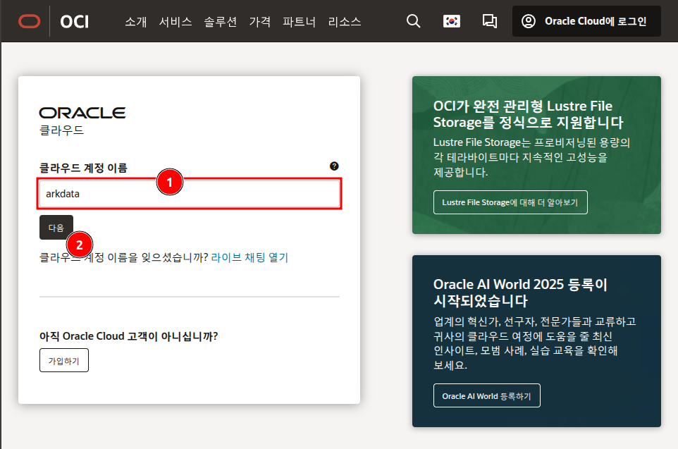
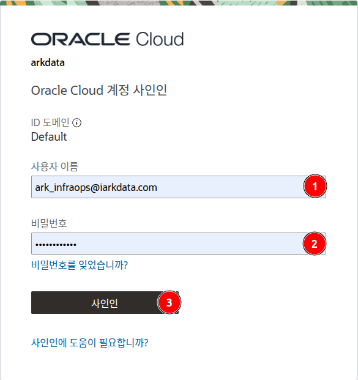
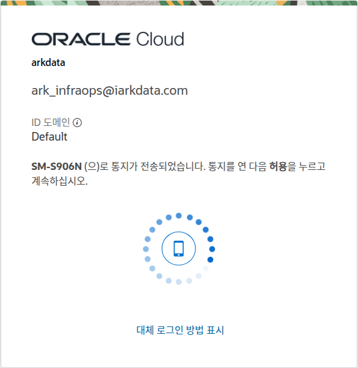

# 사용자 가이드

## 1. OCI 신규 사용자 계정 활성화

OCI 계정 초대를 받은 신규 사용자는 다음 절차에 따라 계정을 활성화하고 MFA(다단계 인증) 설정을 완료해야 합니다.

### 이메일 초대 수락

* OCI 관리자로부터 받은 초대 이메일을 엽니다.
* 이메일 본문에 있는 **Accept Invitation** 버튼을 클릭합니다.

### 패스워드 설정

* **Accept Invitation** 링크를 클릭하면 패스워드를 설정하는 페이지로 이동합니다.
* 규칙에 맞는 새로운 패스워드를 입력하고 확인을 위해 한 번 더 입력합니다.
* **Create Password** 버튼을 클릭하여 패스워드 설정을 완료합니다.

### 클라우드 계정 사인인

* 패스워드 설정이 완료되면 OCI 로그인 페이지로 이동합니다.
* Cloud Account Name (`iarkdata`)이 맞는지 확인하고 **Next**를 클릭합니다.
* 앞서 설정한 패스워드를 사용하여 로그인합니다.

### MFA(다단계 인증) 설정

로그인 후 보안을 위해 MFA(다단계 인증) 설정 페이지로 이동합니다.

* **MFA 활성화**
    - 모바일 기기에 Google Authenticator, Microsoft Authenticator 등 OTP 앱을 설치합니다.
    - OTP 앱을 열고 QR 코드를 스캔합니다.

* **인증 코드 입력**
    - OTP 앱에 표시된 6자리 코드를 OCI 웹페이지의 `Verification Code` 필드에 입력합니다.
    - **Verify** 버튼을 클릭합니다.

* **설정 완료**
    - 성공적으로 인증되면 MFA 설정이 완료됩니다. 이제 OCI 콘솔에 접근할 수 있습니다.

---

## 2. OCI 로그인

이미 계정 활성화를 완료한 사용자는 다음 링크를 통해 OCI 콘솔에 직접 로그인할 수 있습니다.

- **로그인 주소**: [https://www.oracle.com/kr/cloud/sign-in.html](https://www.oracle.com/kr/cloud/sign-in.html)

### 클라우드 계정 이름 입력

* 로그인 페이지에서 Cloud Account Name에 `arkdata`를 입력하고 **Next** 버튼을 클릭합니다.

### 사용자 정보 입력

* Identity provider는 `oracleidentitycloudservice`를 그대로 두고, 사용자 이메일과 패스워드를 입력한 후 **Sign In** 버튼을 클릭합니다.

### MFA 인증

* MFA 앱에 표시되는 6자리 인증 코드를 입력하고 **Verify** 버튼을 클릭하여 로그인을 완료합니다.

